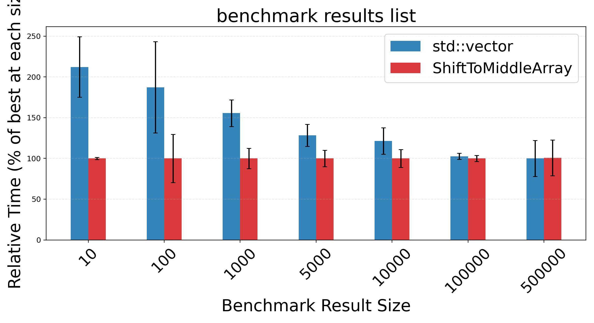
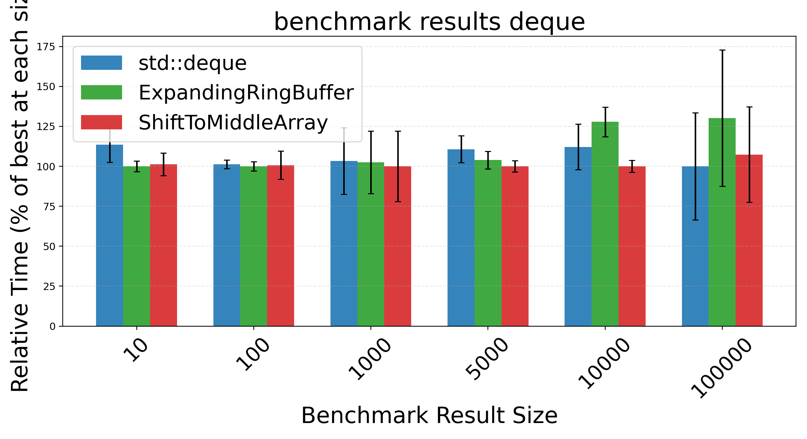
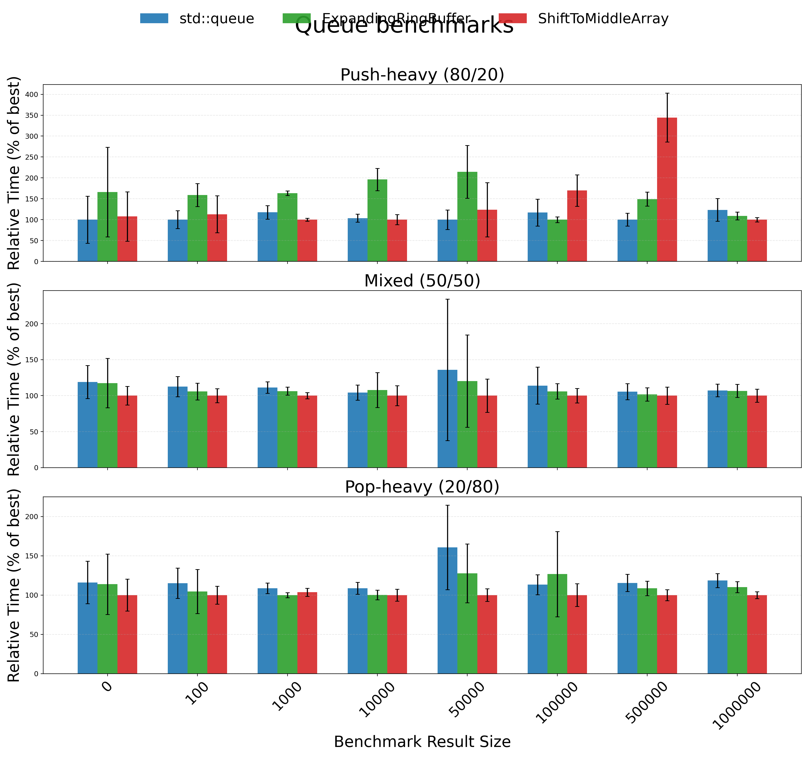

# Shift-To-Middle Array: A contiguous alternative for dynamic end-operations

## Summary

Shift-To-Middle Array (STM) is a contiguous sequence-container strategy for workloads that mix frequent front/back updates with index-based access. Instead of reserving growth slack only at one end, STM recenters active elements during expansion and preserves free space on both sides. The goal is to reduce repeated relocation costs in bursty queue/deque-like mutation patterns while maintaining cache-friendly contiguous storage and constant-time indexing semantics.

This repository provides a C++ implementation of STM, correctness and differential tests, and reproducible benchmarks against standard-library baselines. The results position STM as a practical engineering alternative in mixed front/back mutation scenarios: often competitive with deque-like approaches, frequently stronger in selected mixed/pop-heavy queue-like regimes, and still grounded in conservative claims rather than universal superiority.

## Statement of need

Developers frequently choose between:

- contiguous structures with strong locality and indexing (e.g., vector-like layouts), and
- structures that better tolerate edge mutations (e.g., deque/list-like layouts).

In many real systems, workloads are not purely append-only or purely random-access. Pipelines can alternate between push-heavy and pop-heavy phases, producer-consumer paths can become bursty, and practical applications may combine edge mutations with indexed reads. In these settings, one-sided contiguous growth can incur repeated shifts under front pressure, while pointer-heavy alternatives can weaken locality and indexed-access ergonomics.

STM addresses this gap by preserving contiguous layout while improving tolerance to mixed front/back mutation pressure through two-sided slack. The contribution is not a claim that STM dominates mature STL containers in all scenarios; rather, it offers a reproducible, test-backed implementation strategy for workloads where contiguous access patterns and frequent end mutations must coexist.

## Core design and complexity

STM stores elements contiguously and tracks logical head/tail positions inside a larger allocated block. When free space is exhausted and growth is needed, the active segment is copied into the center of a larger allocation. This re-centering restores slack on both sides and helps amortize future front/back operations.

Conservative complexity positioning is:

- index access: `O(1)`
- end insert/delete: amortized `O(1)`
- middle insert/delete: `O(n)` in the general case

As with classical dynamic arrays, performance constants depend on growth policy and allocator behavior. STM intentionally accepts extra slack-management overhead to reduce repeated edge-shift penalties in mutation-heavy mixed regimes.

## Implementation and reproducibility

This repository includes:

- `ShiftToMiddleArray.h`: core STM implementation,
- `stm_*tests.cpp`: API, unit, smoke, sanity, and differential tests,
- `BenchmarkList.cpp`, `BenchmarkDequeue.cpp`, `BenchmarkQueue.cpp`: benchmark drivers,
- `benchmark_results_*.csv`: reproducible benchmark outputs,
- `visualize.py`: figure-generation pipeline.

Benchmark runs use fixed pseudo-random seeds and repeated measurements with variability reporting. Baselines include `std::vector`, `std::deque`, `std::list`, and queue/deque-relevant adapters where semantically appropriate. This framing supports reproducible comparisons while avoiding over-interpretation of single-run or machine-specific timing points.

## Benchmark overview and interpretation

The benchmark suite covers queue-like, deque-like, and list-like workload families. Interpreted by workload trends rather than isolated point wins, the results show:

- **List-like regimes**: STM is often strong at small-to-medium sizes and can remain competitive at larger sizes.
- **Deque-like regimes**: STM is typically near parity with deque/ring-buffer-style approaches, with both wins and losses.
- **Queue-like regimes**: STM shows its strongest behavior in mixed and pop-heavy settings, while push-heavy behavior can be more variable.

These outcomes support a practical positioning: STM is a viable contiguous alternative for mixed end-mutation workloads, not a categorical replacement for all standard containers.

## Limitations and future work

Absolute timings are hardware-, compiler-, and allocator-dependent. Some workload families are synthetic and may not cover all production access patterns. Future work includes broader cross-platform studies, deeper profiling (cache, branch, allocation behavior), and tuning of growth/re-centering heuristics.

## Acknowledgements

The benchmarking and reporting structure in this repository follows reproducibility-oriented performance evaluation practice and was improved through iterative review and manuscript refinement.

## References