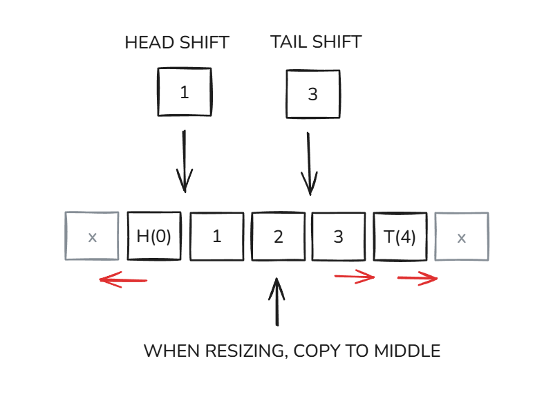

# Shift-To-Middle Array

The **Shift-To-Middle Array** is a dynamic array designed to optimize **insertions and deletions at both ends**, offering a high-performance alternative to `std::deque`, `std::vector`, and linked lists. It achieves this while maintaining **contiguous memory storage**, improving **cache locality** and enabling **efficient parallel processing**.



## 🌟 Features
✅ **Amortized O(1) insertions & deletions at both ends**  
✅ **Fast random access (O(1))**  
✅ **Better cache locality than linked lists**  
✅ **Supports SIMD & parallel optimizations**  
✅ **Efficient memory usage compared to `std::deque`**  

## 📌 How It Works
Unlike `std::deque`, which uses a fragmented block structure, the **Shift-To-Middle Array** dynamically **redistributes space** to avoid costly shifts. When resizing, elements are moved toward the middle, ensuring **efficient insertions at both ends** without excessive copying.

## 🚀 Time Complexity Comparison

The following table compares the time complexity of Shift-To-Middle Array operations with other common data structures:

| Operation                  | ArrayList (`std::vector`) | Linked List | Shift-To-Middle Array |
|---------------------------|--------------------------|-------------|-----------------------|
| Access (by index)          | O(1)                     | O(n)        | O(1)                 |
| Insertion at head          | O(n)                     | O(1)        | O(1) amortized       |
| Insertion at tail          | O(1) amortized           | O(1)        | O(1) amortized       |
| Insertion in middle        | O(n)                     | O(n)        | O(n)                 |
| Deletion at head           | O(n)                     | O(1)        | O(1) amortized       |
| Deletion at tail           | O(1)                     | O(1)        | O(1) amortized       |
| Deletion in middle         | O(n)                     | O(n)        | O(n)                 |
| Cache Locality             | Excellent                | Poor        | Excellent            |

## 🏆 Performance Benchmarks
Benchmarks comparing **Shift-To-Middle Array vs. `std::deque` vs. ExpandingRingBuffer vs. `std::queue`** demonstrate that performance improvements depend on **CPU and GPU capabilities**, such as **multi-core parallelism, SIMD optimizations, and cache efficiency**.

The benchmarks were compiled using **GCC with the `-O3` optimization flag**, ensuring high-performance execution. Results vary based on **hardware specifications** and **workload characteristics**.

## 📂 Installation & Usage
To use Shift-To-Middle Array in your project:
```cpp
#include "ShiftToMiddleArray.h"
ShiftToMiddleArray<int> stmArray;
stmArray.insert_head(42);
stmArray.insert_tail(99);
int value = stmArray.get_head();
stmArray.remove_head();
```

## 🔬 When To Use
- **High-performance queue structures**
- **Game engines & real-time applications**
- **Networking (packet buffering, event queues)**
- **Dynamic sequences in computational geometry & physics**

## 📖 Documentation

### Running Java Benchmarks
To run the **Java benchmarks**, ensure you have the **Trove library** installed. Compile and execute using:
```sh
javac -cp trove-3.0.3.jar; ShiftToMiddleArrayBenchmarkTrove.java
java -cp trove-3.0.3.jar; ShiftToMiddleArrayBenchmarkTrove
```

## 📊 Benchmarks & Results
For full benchmark details, check out the [publication](ShiftToMiddleArray.pdf). The provided **Python scripts** can be used to visualize performance metrics from CSV benchmark results.

## 🏛 History
The Shift-To-Middle Array was independently developed by Attila Torda as a personal project during free time, aiming to create a more efficient implementation strategy for lists and deques. This project explored whether a contiguous-memory approach with dynamic mid-shifting could offer better balance for insertions, deletions, and random access.

- **Designed and implemented without academic/financial support, relying on open-source tools and iterative testing.**
- **Initial results showed promise, with one ICCS 2024 reviewer noting the method’s "reliability" compared to ArrayLists/linked lists (Score: 4/5 on results presentation).**
- **Areas for improvement identified: deeper benchmarking and formal literature review.**

## 📜 License
This project is licensed under the MIT License.

## 🙏 Acknowledgments

This project benefited greatly from community feedback! Special thanks to:

- **Hacker News** and **Reddit's r/algorithms** communities for their technical insights and suggestions that helped refine the core ideas.

**Relevant discussions:**
- [Hacker News thread on data structure efficiency](https://news.ycombinator.com/item?id=43456669)
- [Reddit r/algorithms feedback discussion](https://www.reddit.com/r/algorithms/comments/1jix7zi/comment/mjtou49/?context=3)

*The open exchange of ideas is what makes independent research so valuable — keep the conversations coming!*
## 🤝 Contributing
Contributions are welcome! Feel free to open an issue or pull request.

🚀 **Try Shift-To-Middle Array today and optimize your data structures!**

