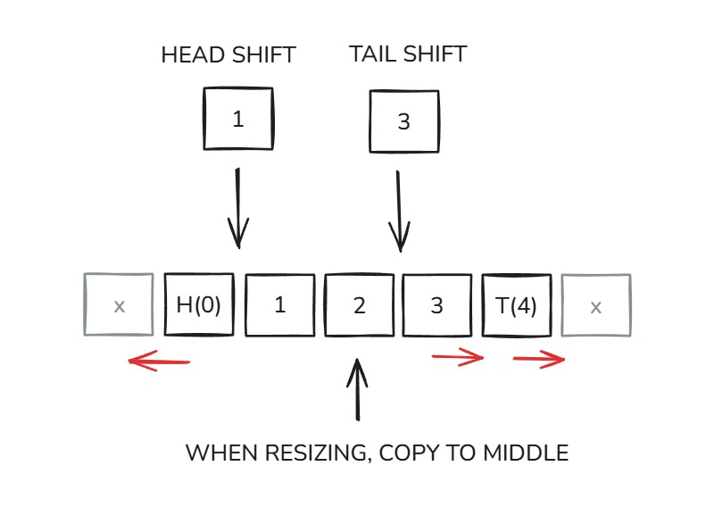

# Shift-To-Middle Array

The **Shift-To-Middle Array** is a dynamic array designed to optimize **insertions and deletions at both ends**, offering a high-performance alternative to implementing dynamic arrays, queues, dequeues. It achieves this while maintaining **contiguous memory storage**, improving **cache locality** and enabling **efficient parallel processing**.



## Features

**-Amortized O(1) insertions and O(1) deletions at both ends**  
**-Fast random access (O(1))**  
**-Better cache locality than linked lists**  
**-Supports SIMD & parallel optimizations**  
**-Minimizes memory overhead and avoids fragmentation unlike std::deque** <br>
**-Dynamic biasing for push-heavy workloads (#define BIAS_MULT)** <br>
**-Manual shrink_to_fit() to reclaim unused memory** <br>
**-Optional automatic shrinking**

## How It Works

To overcome the costly front-insertions of dynamic arrays and the non-contiguous memory of linked lists, the Shift-To-Middle Array proactively re-balances its data. During a resize, it shifts the contents to the middle, ensuring ample room for growth on both ends and minimizing future copy operations, without sacrificing the performance benefits of contiguous memory.

## Time Complexity Comparison

The following table compares the time complexity of Shift-To-Middle Array operations with other common data structures:

| Operation                  | Dynamic Array           | Linked List | Shift-To-Middle Array |
|---------------------------|--------------------------|-------------|-----------------------|
| Access (by index)          | O(1)                     | O(n)        | O(1)                 |
| Insertion at head          | O(n)                     | O(1)        | O(1) amortized       |
| Insertion at tail          | O(1) amortized           | O(1)        | O(1) amortized       |
| Insertion in middle        | O(n)                     | O(n)        | O(n)                 |
| Deletion at head           | O(n)                     | O(1)        | O(1)                 |
| Deletion at tail           | O(1)                     | O(1)        | O(1)                 |
| Deletion in middle         | O(n)                     | O(n)        | O(n)                 |
| Cache Locality             | Excellent                | Poor        | Excellent            |

Note: Deletion at head and tail are O(1) if shrinking is disabled, and O(1) amortized if shrinking is enabled (since resizing only occurs occasionally).

## Theoretical Properties of STM Array

| Operation | Best Case | Average Case | Worst Case | Notes |
|---|---:|---:|---:|---|
| **Random Access** | Θ(1) | Θ(1) | Θ(1) | Direct index translation over contiguous storage |
| **Insert at Front/Back** | Θ(1) | Θ(1) amortized | Θ(n) | Linear case occurs during resize/recenter |
| **Delete at Front/Back** | Θ(1) | Θ(1) amortized* | Θ(n) | *Amortized when optional shrinking is enabled; otherwise Θ(1) without resize |
| **Middle Insert** | Θ(1)** | Θ(n) | Θ(n) | **Θ(1) only in narrow cases with adjacent slack; generally requires shifting |
| **Middle Delete** | Θ(1)** | Θ(n) | Θ(n) | **Θ(1) only in narrow cases with adjacent slack; generally requires shifting |

This README now aligns with the revised paper: we **do not claim amortized Θ(1)** for general middle insert/delete workloads.

#### Key to Notations:
- **Θ(f(n))**: Tight bound (both upper and lower)
- **O(f(n))**: Upper bound
- **o(f(n))**: Strictly better than O(f(n))

## Performance Benchmarks
Benchmarks comparing **Shift-To-Middle Array vs. `std::deque` vs. ExpandingRingBuffer vs. `std::queue`** demonstrate that performance improvements depend on **CPU and GPU capabilities**, such as **multi-core parallelism, SIMD optimizations, and cache efficiency**.

The benchmarks were compiled using **GCC with the `-O3` optimization flag**, ensuring high-performance execution. Results vary based on **hardware specifications** and **workload characteristics**. <br>

-AMD Ryzen 5 2600X Six-Core Processor <br>
-NVIDIA GeForce GTX 1660 SUPER <br>
-16GB RAM <br>

For full benchmark details, check out the [paper](Papers/ShiftToMiddleArray_WorkingPaper.pdf). The provided **Python scripts** can be used to visualize performance metrics from CSV benchmark results.

**Note**: Performances are being reevaluated as I'm making a new version of the publication!

## Installation & Compilation
The Shift-To-Middle Array is a single-header, templated C++ class. To use it, simply include ShiftToMiddleArray.h in your project. Requirements: C++ 20 or later and a standards-compliant compiler. I recommend to compile with these flags: <br>

```sh
g++ -std=c++20 -Ofast -Wall -Wextra -Werror -pedantic main.cpp BenchmarkQueue.cpp BenchmarkDequeue.cpp BenchmarkList.cpp -o queue_benchmarks
```

To run the **Java benchmarks**, ensure you have the **Trove library** installed. Compile and execute using:
```sh
javac -cp trove-3.0.3.jar; ShiftToMiddleArrayBenchmarkTrove.java
java -cp trove-3.0.3.jar; ShiftToMiddleArrayBenchmarkTrove
```

## 🔬 Possible Applications

- **Embedded Systems**
- **Game Engines & Real-Time Applications**
- **Backend Frameworks**
- **Scientific Computing**

## History

The Shift-To-Middle Array was developed by Attila Torda as a personal project during free time, aiming to create a more efficient implementation strategy for lists and deques. This project explored whether a contiguous-memory approach with dynamic mid-shifting could offer better balance for insertions, deletions, and random access. I wrote a white paper and wanted to publish it, but got rejected.

- **Designed and implemented without academic/financial support, relying on open-source tools and iterative testing.**
- **Initial results showed promise, with one ICCS 2025 reviewer noting the method’s "reliability" compared to ArrayLists/linked lists (Score: 4/5 on results presentation).**
- **Areas for improvement identified: deeper benchmarking and formal literature review.**

After the rejection for publication I implemented the **bias** feature. I plan to make more tests, benchmarks and improvements, then try to publish it again.

## FAQ

**Is this a gap buffer??**

The Shift-to-Middle (STM) Array can be formally interpreted as a generalization of the gap buffer model.

A classical dynamic array may be described as a degenerate gap buffer in which the gap is always positioned at the end of the buffer. In contrast, STM maintains allocational slack in a way that allows free-space regions to exist near both ends of the logical sequence, and to be repositioned during rebalancing operations.

Unlike a standard gap buffer, STM does not maintain a single contiguous movable gap. Instead, it maintains a distributed slack model across the underlying array, with periodic re-centering and redistribution driven by workload-dependent heuristics.

**Is this a ring buffer?**

No.

Ring buffers implement a circular indexing scheme over a fixed-size or periodically resized array, where logical ordering is defined modulo the array capacity. In such structures, head and tail indices may wrap around, and physical contiguity of elements is not preserved.

STM maintains a linear physical layout invariant: for any valid state, the logical head precedes the logical tail in contiguous memory order. No modular arithmetic over indices is used to represent wrap-around state. As a consequence, iteration over the structure preserves spatial locality in memory.

**Did you reinvent the array-based deque?**

No direct equivalence holds, although both structures share a contiguous memory representation and support amortized O(1) operations at the boundaries.

Standard array-based deques (circular buffer implementations) optimize primarily for amortized constant-time insertion and deletion at both ends. Operations that modify the middle of the sequence typically require shifting O(n) elements, depending on the position of insertion and current occupancy.

STM retains the same boundary operation guarantees but modifies the cost model for interior updates by introducing a directional shift heuristic. When an insertion or deletion occurs, the implementation selects the smaller of the two affected segments (prefix or suffix relative to the operation site) for relocation. This reduces expected movement cost under non-adversarial access distributions.

In addition, STM introduces a bias parameter used during reallocation events. This parameter influences the placement of the active region within newly allocated storage, effectively encoding a preference for head- or tail-weighted workloads. The intent is to reduce future relocation costs by aligning initial layout with observed access asymmetry.

The resulting structure can be characterized as a contiguous sequence container with adaptive internal alignment, rather than a fixed symmetric deque layout.

**Was external assistance used in development?**

Yes.

Development included the use of AI-based tools for exploratory design and naming, as well as iterative refinement of implementation details. Due to context limitations in automated tools, all substantive changes required manual verification.

Feedback from public technical discussions (notably Hacker News and r/algorithms) contributed to clarifications of terminology and edge-case behavior.

[Hacker News thread on data structure efficiency](https://news.ycombinator.com/item?id=43456669) <br>
[Reddit r/algorithms feedback discussion](https://www.reddit.com/r/algorithms/comments/1jix7zi/comment/mjtou49/?context=3)

## Variations

**Fixed-Size Implementation** <br>
A simple, memory-efficient version where the array has a predefined maximum capacity.

**Unrolled Shift-to-Middle Array** <br>
A hybrid between an unrolled linked list and a shift-to-middle (STM) array, balancing cache efficiency and dynamic operations.

**Shift-to-Middle Ring Buffer** <br>
A ring buffer whose head and tail are moved to the middle. Resizing could occur when the array is full, or when a certain condition is met, ie. an insert operation is requested while the head is already behind the tail and the array is 80% full.

**Hybrid Array Combinations** <br>
It's possible to combine different array implementations (ring buffer, STM array and unrolled linked list) to create a hybrid aray, which changes implementations at different array sizes.

## License

This project is distributed under the terms of the MIT License. The full license text can be found in the  [LICENSE](LICENSE) file.
